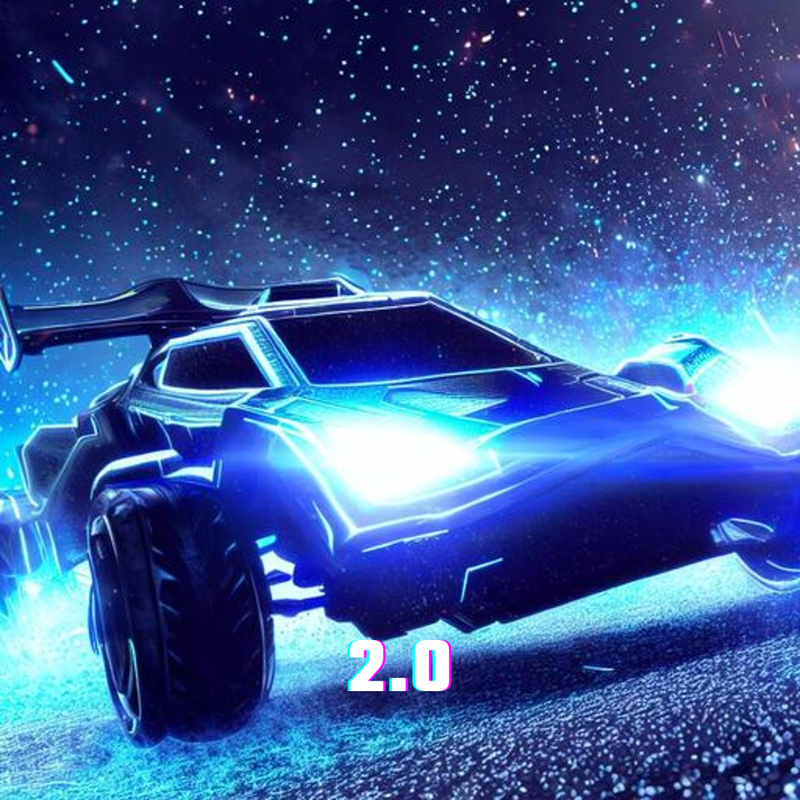

# Stardust: A Rocket League Bot

## Stardust 3.0 robustness follow-up

This branch addresses the reported shot-accuracy regressions, crowded defensive positioning, aerial height overshoot, low boost, slow threat response, and goal-post collisions. It includes regression reproductions of the old failures, role-separated defense, braking-aware navigation, corrected steering/geometry, and revised aerial boost control.

See **[the robustness changes, evidence, reset diagnostics, and test guide](docs/ROBUSTNESS.md)**. The code builds and is checked with deterministic and analytic scenarios; those checks are not a live win-rate or mechanics-success benchmark. Flip resets remain experimental and require `STARDUST_FLIP_RESETS=1` in the actual bot process environment. `STARDUST_TRACE=1` reports whether they are enabled and logs selection/attempt outcomes.

The earlier **[Stardust 3.0 implementation, research, and evaluation guide](docs/STARDUST_3.md)** describes the original candidate and longer-term learned-skills roadmap. The robustness guide supersedes its strategy/controller descriptions where changed. No trained neural policy is included, and the original bot registration identity is retained.

## Project background

Stardust is a Rocket League bot built on the [RLBot](http://www.rlbot.org/) framework for offline matches, using RedUtils (C#). This branch targets the vendored RLBot v5 integration; use a compatible v5 setup rather than assuming an older GUI/runtime is interchangeable.

## Stardust 2.0 history

The original Stardust 2.0 was optimized for 2v2 and 3v3 and was redeveloped for the RLBot Championship finals. The repository records a fourth-place finish in the **RLBot Championship 2023**; the original finals video is [here](https://www.youtube.com/watch?v=6A8_6RR4vR0&t=305s).

The 3.0 candidate retains the existing shot solvers, kickoff routines, and drive subactions, while improving the control lifecycle and introducing possession controllers. The [evaluation guide](docs/STARDUST_3.md#promotion-criteria-run-these-in-rocket-league-before-a-release) separates software checks from the in-game evidence needed to establish playing strength.
