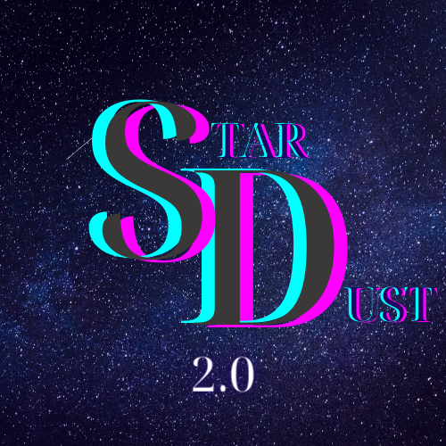

# Stardust: A Rocket League Bot

Welcome to the repository for Stardust, an advanced Rocket League bot built on the [RLBot](http://www.rlbot.org/) framework. Stardust is designed to compete in offline Rocket League matches and aims to provide a challenging experience for players.

## Quick Start Guide

To get started with Stardust, follow these simple steps:

1. **Download RLBotGUI**: If you haven't already, download and install [RLBotGUI](https://github.com/RLBot/RLBotGUI).
2. **Clone This Repository**: Download this repository to your local machine.
3. **Launch RLBotGUI**: Open the RLBotGUI application.
4. **Add Stardust**: Click on the "Add" button located at the top-left corner.
5. **Load Repository**: Choose "Load Folder" and navigate to the folder where you've cloned this repository.

## About Stardust v2.0

Stardust v2.0 is the latest iteration of the bot, now powered by RedUtils (C#). Currently, the bot is optimized for 2v2 and 3v3 matches. Support for 1v1 matches is planned for future releases. Despite being redeveloped in just two weeks for the RLBot Championship finals, Stardust has shown promising performance.

## Future Plans

This bot serves as a foundational project, and extensive updates are planned for the future. A complete rewrite is also under consideration to enhance its capabilities further.

## Achievements

- **RLBot Championship 2023**: Stardust secured a commendable *fourth* place.

---
